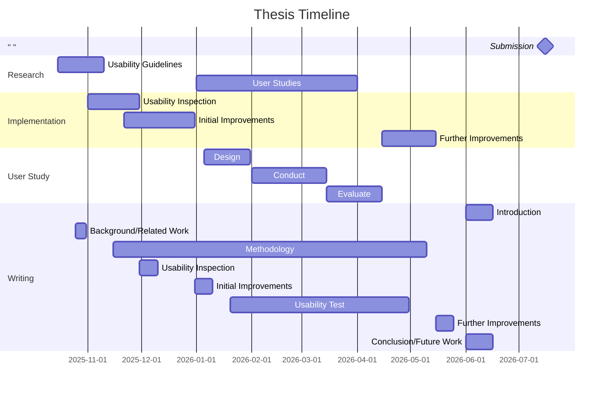

# Something with Usability in PIX:E

- [?] "Usability" in German - auch Usability? oder Gebrauchstauglichkeit?

## Goal

- implement sustainable/maintainable and effective usability/accessibility principles

>[!star] Possible LLM angles
>- usability/general user experience of AI components
>- LLM-supported accessibility
>- LLM-supported Usability Design (agents for usability evaluation, study design etc)

## Approach

### 0. Exploratory Research

- fundamental guidelines and principles of usability
- focus: open source software, planning tools, design toolkits...
### 1. Usability Inspection (Audit)

- examine existing software components
	- maybe focus on some parts of it only
- evaluate current state based on results from 0.
### 2. Initial Improvements

- implement improvements based on inspection and research
### 3. Usability Test (User Study)

- use improved version
	- maybe another round afterwards?
- steps:
	- research how to conduct a user study
	- design user study
	- find participants + conduct study
	- evaluate results

### 4. Further Improvements

- integrate feedback from user study

## Timeline

