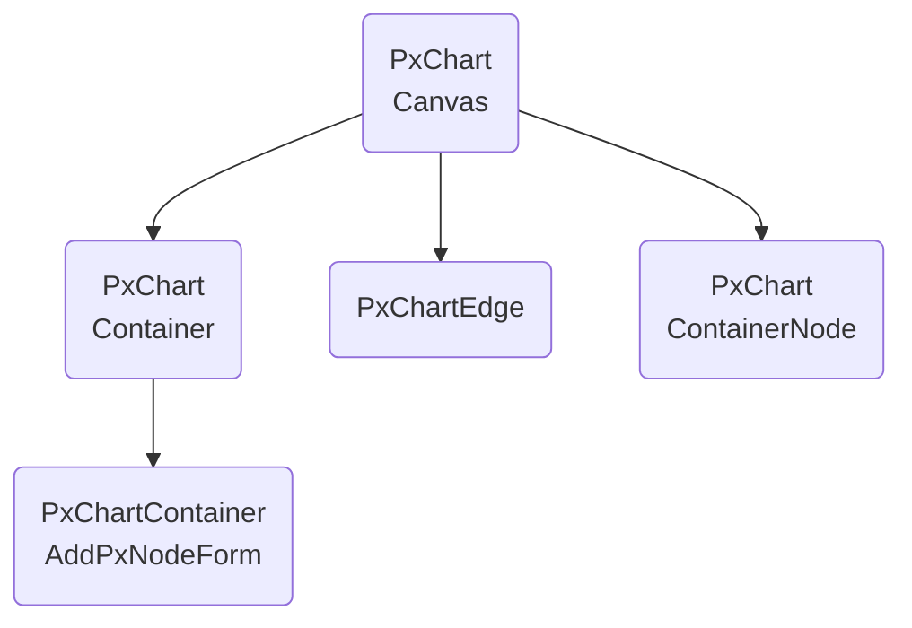
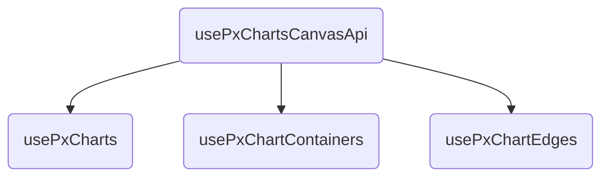

-> [[FRONTEND.canvas|FRONTEND]]

- [x] Vue.js [tutorial](https://vuejs.org/tutorial/#step-1) ✅ 2025-11-23
- [x] understand hierarchy of relevant files ✅ 2025-11-21
- [x] understand what each is for ✅ 2025-11-23

## Hierarchy

### `components/`

- `PxChartContainer` : used on overview page
- `PxChartContainerNode`: used on canvas/chart

### `composables/`

#### `usePxChartsCanvasApi`

- has `nodes`, `edges`, `loading`, `error`
- default values for containers, edges
- `loadGraph`
- `addContainer`
- `updateContainer`
- `addNodeToContainer`
- `removeNodeFromContainer`
- `deleteContainer`
- `addEdge`
- `deleteEdge`

### `pages/`

#### `pxcharts/[id].vue`

- page for specific chart

#### `pxcharts/index.vue`

- overview page over all charts