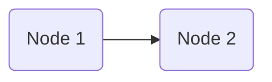

- [x] define requirements 🛫 2025-11-21 ✅ 2025-11-24
- [x] figure out where to implement what 🛫 2025-11-24 ✅ 2025-12-06
- [x] implement simple path selection ✅ 2025-12-05
	- [x] between two nodes ✅ 2025-12-01
	- [F] between more than two nodes
- [F] test simple path selection

- [F] prevent toast message for each
- [x] look at PxExpectations to see how they implemented things ✅ 2025-12-14

## Requirements

- path defined by start + end nodes
- path (nodes + edges) made visible in chart
	- either select/highlight
	- or color differently
- path is temporarily saved

- [i] how to select nodes?
	- vueflow node props include boolean `selected`  , not optional
	- edges also have this prop, optional

## Implementation

### Requirements

- path represented by nodes + edges -> list
	- level: chart -> for calculation and storing
	- `usePxChartCanvasApi`
- coloring/highlighting
	- level: nodes/edges
- selection of start/end nodes
	- is selection of container
	- selected component:   `PxChartContainerNode.vue`

- [r] nodes/edges need to know they're selected/part of the path
- [r] path needs to be calculated and managed on chart level 

-> high-level logic: [[path-selection-logic.canvas|path-selection-logic]]

### Step 1: Path selection between two nodes

- [x] implement path finding logic ✅ 2025-11-28
	- [i] Dijkstra -> [[#Path Calculation]]
- [x] integrate with UI ✅ 2026-01-16
	- [x] trigger path calculation on selection of two nodes in order ✅ 2025-12-01
		- selection processed by `onSelectionChange()` in `PxChartCanvas.vue`
		- calls `calculatePathFromSelection(ids)` in `usePxChartsCanvasApi.ts`
			- as of 2026-01-23: only when selection changes from one to two nodes
		- calls `calculate_path(nodes, edges, selected)` in `pathsApi.ts`
	- [x] highlight calculated path ✅ 2026-01-16
		- `highlightPath()` and `resetPath()` in `usePxChartsCanvasApi.ts`
			- changes `style` of nodes

### Path Calculation

- start with Dijkstra (start simple, then expand later)

```ts title="Dikstra"  
function dijkstra_path(nodes: Node[], edges: Edge[], sourceId: string, targetId: string) {
	
	// initialize
	let q = [ {'id': sourceId, 'prio': 0 } ];
	let dist = new Map<string, number>();
	dist.set(sourceId, 0);
	let prev = new Map<string, string>();
	
	for (const node of nodes) {
		if (node.id != sourceId) {
			dist.set(node.id, Infinity);
			q.push({'id': node.id, 'prio': Infinity })
		}
	}
	
	// sort (descending so we can use pop)
	q.sort((n1, n2) => n2.prio - n1.prio);
	
	// iterate
	let found = false;
	while (q.length && !found) {
		let node = q.pop();
        if (!node) {
            break;
        }
		let outs = getOutgoers(node.id, nodes, edges);
		for (const out of outs) {
            let alt = dist.get(node.id) + 1;
            if (alt < dist.get(out.id)) {
                prev.set(out.id, node.id);
                dist.set(out.id, alt);
                let idx = findIndex(q, ['id', out.id]);
                q[idx].prio = alt;
                q.sort((n1, n2) => n2.prio - n1.prio);
            }
            if (out.id == targetId) {
				found = true;
                break;
			}
		}
	}
	
	let seq = [];
	if (found) {
		// construct sequence
		let current = targetId;
		if (prev.has(current) || current == sourceId) {
            while (current) {
			    seq.push(current);
			    current = prev.get(current);
            }
		}
	}

	return seq.reverse();
}
```

- expand: 


### Path Highlighting

- [i]   `updateNode()` is used in [examples](https://vueflow.dev/examples/nodes/update-node.html), but is apparently already [deprecated](https://vueflow.dev/typedocs/functions/updateEdge.html)?

- [i] vue-flow nodes are initialized from `PxChartContainers` in `usePxChartsCanvasApi`
	- any crud updates are made to both the vue-flow nodes/edges and the underlying database
	- [?] should diagrams/path selections be persisted as well?
		- [p] no re-calculations
		- [c] redundancy 

## Testing



- [t] T1: path between two neighboring nodes -> selection should stay, edge should also be selected


- [t] T2: path between three  nodes


## Questions

- [?] access to old code?

## Research To Do

- [R] pathfinding in PaceMaker
- [R] brush up on pathfinding algorithms

