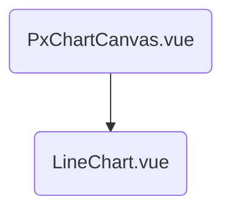

- [x] implement selector for `PxComponentDefinition` ✅ 2025-12-06
- [/] implement component for line diagram
	- [x] filter for numeric values ✅ 2025-12-11
	- [x] smaller size ✅ 2025-12-14
	- [/] improve on color scheme
- [x] implement diagram on single component selection ✅ 2025-12-12
- [x] implement diagram on path selection ✅ 2025-12-14
- [F] improve on user experience
	- [F] toasts for diagram generation
- [F] BUG: have to reload site after navigating to it?

---

## Implementation Details

- selector: [`USelect` component](https://ui.nuxt.com/docs/components/select)

- [?] it seems to me like node names are used as ids in some places. are we working under the assumption that node names are unique?
