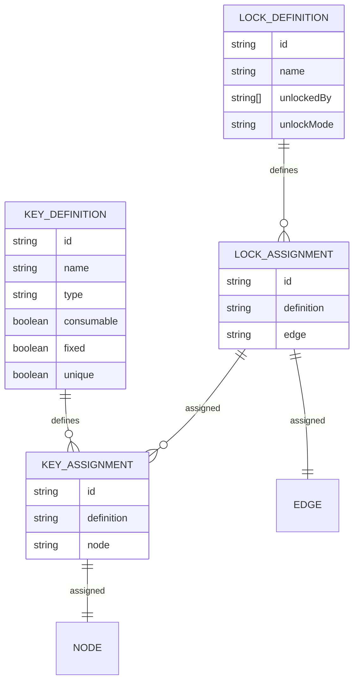

- [x] research + define requirements ✅ 2026-03-02
- [x] integrate into data structure ✅ 2026-03-16
- [x] add creation functionality (similar to PxComponents) ✅ 2026-03-16
- [x] add adding functionality (similar to PxComponents) ✅ 2026-04-12
	- [x] keys into nodes -> in Node page ✅ 2026-03-16
	- [x] locks into edges -> in PxChart page 🛫 2026-03-23 ✅ 2026-04-12
- [x] visualize locks in PxCharts ✅ 2026-04-10
- [x] visualize keys in PxCharts ✅ 2026-04-12
- [/] write about modeling locks and keys -> [[03-lock-and-key-modelling]]

## Modeling Locks/Keys
see also [[05-lock-key-dynamic/thoughts|thoughts]]

>[!goal] flexibility as a design philosophy: make highly configurable for users

>[!example]
>```mermaid
>graph LR
>	a([A]) --> b([B])
>	b --> c([C])
>	b --LOCK--> d([D])
>	c --> e([E: KEY])
>	e --> g([G])
>	d --> e
> ```

- [/] add to data model -> [repo wiki: workflow](https://github.com/gamedevlabs/pix-e/wiki/Workflow-to-Extend-Models)
	- [i] extend nodes/chart or add new app? -> extend
		- simpler
		- follow split of existing architecture
		- in case of future refactoring, makes it clearer which level each component belongs to
		- frontend types are unified anyways
	- [x] add to django models + migrate ✅ 2026-03-14
	- [x] update serializer ✅ 2026-03-14
	- [x] update api ✅ 2026-03-16
	- [x] update frontend types -> `px.d.ts` ✅ 2026-03-16
	- [x] update frontend api fetching -> `usePxThing.ts` ✅ 2026-03-16
	- [x] update ui components: PxNodes ✅ 2026-03-16

### Data Model



^lockkeydatamodel

### Taxonomy by Dormans

[@dormansCyclicGeneration2017]:
>When you unlock a door, that door might remain unlocked forever (permanent), for a short period of time (temporary), or until it is relocked (reversible). Sometimes, a lock collapses after use, allowing the player only to pass once.

-> locks: **permanent, temporary, reversible, collapsible**

[@dormansCyclicGeneration2017]:
>Certain locks allow you to cross only in one direction (valves), while others can only be opened from one direction but traversed in two directions after they are opened (asymmetrical). \[...] Valves do not always require a key.

-> locks: **valve, asymmetrical**
- locks are assigned to edges, so valves can already be modeled. only question: what if one unlock opens it for both directions? TODO

[@dormansCyclicGeneration2017]:
>A safe lock is guaranteed to have a solution, while an unsafe lock is not.

-> TODO

[@dormansCyclicGeneration2017]:
>Single-purpose keys can only be used to open a lock, and for nothing else, while multipurpose keys can also be used in different ways.

-> keys: **single-purpose or multi-purpose**
- attribute `type` on keys: `ability`, `item`

[@dormansCyclicGeneration2017]:
>Particular keys are the only thing that unlocks a particular lock, whereas several nonparticular keys might unlock a single lock.

-> keys: **particular or non-particular**
- probably easier to understand when this is a property of a lock, i.e. key requirement

[@dormansCyclicGeneration2017]:
>Keys that are destroyed somehow in the process of unlocking a door are consumable, while keys that are not are persistent.

-> keys: **consumable or persistent**

[@dormansCyclicGeneration2017]:
>Levers and switches are the best example of keys that are fixed in place (and typically single purpose and particular as well).

-> keys: **fixed or not**

## Creating/Editing Locks/Keys

- [x] add card components ✅ 2026-03-14
- [ ] adapt card components
	- [ ] `PxKeyCard`, `PxKeyCardDetailed`, `PxKeyCardPreview`
	- [x] `PxKeyDefinitionCard`, `PxKeyDefinitionCardDetailed`, `PxKeyDefinitionCardPreview` ✅ 2026-03-16
	- [ ] `PxLockCard`, `PxLockCardDetailed`, `PxLockCardPreview`
	- [x] `PxLockDefinitionCard`, `PxLockDefinitionCardDetailed`, `PxLockDefinitionCardPreview` ✅ 2026-03-16
	- [x] `PxKeyCreationForm`, `PxLockCreationForm`
- [x] add page for creating locks/keys: based on PxComponentDefinitions ✅ 2026-03-14
	-  `frontend/app/pages/pxlockkeydefinitions.vue`

- [x] try creating key definition ✅ 2026-03-16
- [x] try creating lock definition ✅ 2026-03-16

- [F] add links to keys in UnlockedBy -> [[05-misc-improvements#Add Cross-Links Wherever Possible]]
- [F] add requirements for inputs -> [[05-misc-improvements#Input Validation]]
- [F] fix creation of PxLockDefinitions -> [[03-lock-key-pathfinding]]

## Editing Definitions

- [x] add correct fields for lock definitions ✅ 2026-03-16
- [x] add correct fields for key definitions ✅ 2026-03-16

## Assigning Locks

- [x] keys in nodes: similar to components ✅ 2026-03-23
	- select definition and count

## Assigning Keys

1. detect edge selection in `PxChartCanvas.vue` :LiCheck:
2. bring up menu in canvas corner :LiCheck:
	- locks: brings up editable menu
3. on added edge:
	- backend: add lock to data structure
	- frontend: if any lock exists, show lock as label

- [x] menu for adding lock to edge ✅ 2026-04-10
	- [x] adding locks ✅ 2026-04-10
	- [x] show existing locks ✅ 2026-04-10
	- [x] handle closing via x -> returns undefined ✅ 2026-04-10

| Version 1                            | Version 2                            |
| ------------------------------------ | ------------------------------------ |
| ![[Pasted image 20260410133345.png]] | ![[Pasted image 20260410143407.png]] |

- [x] `PxChartCanvas.vue`: on edge selection, bring up menu ✅ 2026-03-23
- [F] frontend: reactive visualization based on `locks` field in `PxChartEdge`

- [x] make updating counts easier ✅ 2026-04-10
- [x] add info about what keys unlock a lock ✅ 2026-04-12

![[Pasted image 20260412173951.png]]

## Visualizing Locks/Keys

- [x] keys in nodes: similar pill like other components
	- add count or individual? (no need to count vs slightly different semantics of numbers from components) -> probably count is easier
- separate visualization
- [x] locks on edges: ~~name~~ lock symbol ✅ 2026-04-12
	- [x] show lock symbol on edge conditionally ✅ 2026-04-10
	- [-] re-fetch after adding new locks -> should be reactive
	- [x] make size larger ✅ 2026-04-12

[@brownHowMyBoss2026]:
- high-level visual representation, only focuses on locks and keys and where they are in relation to each other

## Intended Workflow

- start with nodes and chart configured
- on lock/key definition page: define locks and keys
- on node page: add keys to nodes
- on chart page: add locks to edges


## Archive

```js title="PxLockEditForm.vue" fold=true
<script setup lang="ts">
import { UInputNumber } from '#components';

const props = defineProps<{ selectedEdge: PxChartEdge, chartId: string }>()

const { createItem: createPxLock, updateItem: updatePxLock, deleteItem: deletePxLock, fetchAll: fetchPxLocks, items: pxLocks } = usePxLocks(props.chartId)
const { items: pxLockDefinitions, fetchAll: fetchPxLockDefinitions } = usePxLockDefinitions()

onMounted(() => {
  fetchPxLocks()
  //printLocks()
  //console.log(JSON.stringify(pxLocks.value))
  fetchPxLockDefinitions()
  initializeState()
})

export interface LockInfo2 {
    defId: string,
    defName: string,
    count: number,
    modified: boolean,
    lockId: string | undefined
}

export interface LockInfo {
    defId: string,
    defName: string,
    currentCount: number,
    newCount: number,
    lockId: string | undefined
}

const emit = defineEmits<{
  close: (payload: { edgeId: string }) => void
}>()

const existingLockIdsForSelectedEdge = computed(() => {
    return props.selectedEdge.locks ? props.selectedEdge.locks.map(lock => lock.id) : []
})

const availableDefinitionsForSelectedEdge = computed(() => {
  return pxLockDefinitions.value.filter(
    (def) => !existingLockIdsForSelectedEdge.value.includes(def.id)
  )
})

function getNameFromDefinitionId(defId: string) {
    console.log(defId)
    return pxLockDefinitions.value.find(def => def.id === defId)!.name
}

const state : Ref<Record<string, LockInfo>> = ref({})

function printLocks() {
    console.log(`locks: ${pxLocks.value.toString()}`)
}

async function initializeState() {
    await fetchPxLocks()
    console.log('initializing state...')
    /*
    if (props.selectedEdge.locks) {
        props.selectedEdge.locks.forEach(lock => {
            state.value[lock.definition] = {
                defId: lock.definition,
                defName: getNameFromDefinitionId(lock.definition),
                count: lock.count,
                modified: false,
                lockId: lock.id
            }
        })
    }
        */

        /*
    pxLocks.value
        .filter((lock) => lock.edge === props.selectedEdge.id)
        .forEach(lock => {
            state.value[lock.definition] = {
                defId: lock.definition,
                defName: getNameFromDefinitionId(lock.definition),
                count: lock.count,
                modified: false,
                lockId: lock.id
            }
        })
            */
    
    pxLockDefinitions.value.forEach((def) => {
        const instance = pxLocks.value.find((lock) => lock.edge === props.selectedEdge.id && lock.definition === def.id)
        if (instance) {
            state.value[def.id] = {
                defId: def.id,
                defName: getNameFromDefinitionId(def.id),
                currentCount: instance.count,
                newCount: instance.count,
                lockId: instance.id
            }
        } else {
            state.value[def.id] = {
                defId: def.id,
                defName: getNameFromDefinitionId(def.id),
                currentCount: 0,
                newCount: 0,
                lockId: undefined
            }
        }
    })
    

    /*
    availableDefinitionsForSelectedEdge.value.forEach(def => {
        state.value[def.id] = {
            defId: def.id, 
            count: 0,
            modified: false,
            lockId: undefined
        }
    })
    */

    console.log(`successfully initialized state. found ${Object.entries(state.value).length} locks for edge with id ${props.selectedEdge.id}`)
    console.log(`state: ${JSON.stringify(state.value)}`)
}

function handleDeleteLock(defIdToDelete: string) {
    /*
    const indexToUpdate = state.value.findIndex(info => info.defId === defIdToDelete);
    
    if (!indexToUpdate) {
        console.warn(`Cannot delete lock`)
        return
    }
        */
    
    state.value[defIdToDelete]!.count = 0
}

async function onSubmit() {

  Object.values(state.value).forEach(async (info) => {
    if (info.currentCount === 0 && info.newCount > 0) {
        // TODO fix bad request
        // create new lock
        const lockId = await createPxLock({
            px_chart: props.chartId,
            edge: props.selectedEdge.id,
            definition: info.defId,
            count: info.newCount,
        })
        info.lockId = lockId
    } else if (info.currentCount > 0 && info.newCount === 0) {
        // delete existing lock
        await deletePxLock(info.lockId!)
        info.lockId = undefined
    } else if (info.lockId) {
        // update existing lock
        // TODO: make more efficient by filtering for actually modified locks
        await updatePxLock(info.lockId, {
            edge: props.selectedEdge.id,
            definition: info.defId,
            count: info.newCount
        })
    }
    // state.value = Object.fromEntries(Object.entries(state.value).filter(info => info[1].count > 0))
    info.currentCount = info.newCount
  })

  emit('close', { edgeId: props.selectedEdge.id })
}

const newLockDef: Ref<string> = ref('')
const newLockCount: Ref<number> = ref(1)

function onClick() {
    console.log(`adding lock with id: ${newLockDef.value}`)
    state.value[newLockDef.value] = {
        defId: newLockDef.value, 
        defName: getNameFromDefinitionId(newLockDef.value),
        count: newLockCount.value,
        modified: false,
        lockId: undefined
    }
    newLockDef.value = ''
    newLockCount.value = 1
}
</script>

<template>
  <UModal :title="'Add/Edit Locks'">
    <template #body>
      <UForm :state="state" class="space-y-4" @submit="onSubmit">

        <!--
        <div v-for="entry in Object.entries(state)" :key="entry[0]">
            <UFieldGroup>
                <UBadge class="min-w-64" :label="entry[1].defName" size="lg" variant="outline" />
                <UInputNumber v-model="entry[1].count" />
                <UButton color="error" icon="i-lucide-trash-2" variant="subtle" @click="handleDeleteLock(entry[1].defId)"  />
            </UFieldGroup>
        </div>

        <div v-if="availableDefinitionsForSelectedEdge.length === 0">
            The selected edge already has a pxlock for each definition available.
        </div>

        <div v-else>
            <UFieldGroup>
                <USelect 
                v-model="newLockDef"
                class="min-w-64"
                value-key="id"
                label-key="name" 
                placeholder="Select PxLock Definition"
                :items="availableDefinitionsForSelectedEdge" />
                <UInputNumber v-model="newLockCount" />
                <UButton color="success" icon="i-lucide-plus" variant="subtle" @click="onClick()"  />
            </UFieldGroup>
        </div>
        -->

        <div v-for="entry in Object.entries(state)" :key="entry[0]">
            <UFieldGroup>
                <UBadge class="min-w-64" :label="entry[1].defName" size="lg" variant="outline" />
                <UInputNumber v-model="entry[1].newCount" />
            </UFieldGroup>
        </div>

        <UButton class="right-0" type="submit"> Submit </UButton>
      </UForm>
    </template>
  </UModal>
</template>

<style scoped></style>

```

