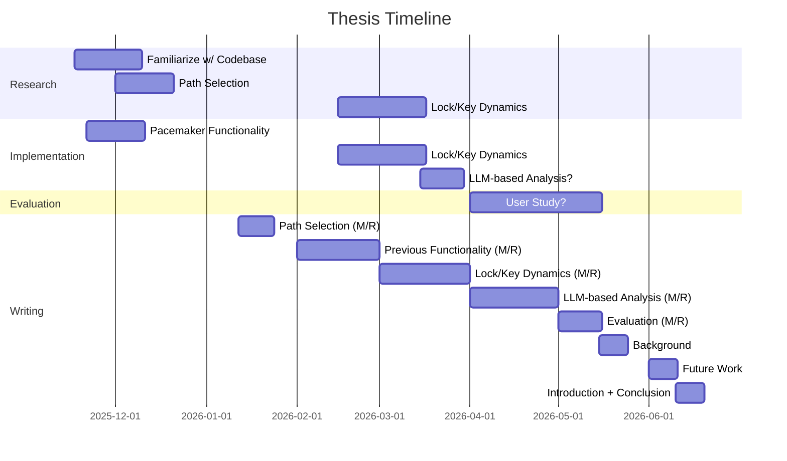

```mermaid
gantt
    title Thesis Timeline
    dateFormat YYYY-MM-DD
    section Research
        Familiarize w/ Codebase  :2025-11-17, 23d
        Path Selection           :2025-12-01, 20d
        Lock/Key Dynamics        :2026-02-15, 30d
    section Implementation
        Pacemaker Functionality  :2025-11-21, 20d
        Lock/Key Dynamics        :2026-02-15, 30d
        LLM-based Analysis?      :2026-03-15, 15d
    section Evaluation
	    User Study?              :2026-04-01, 45d
    section Writing
        Path Selection (M/R)          :2026-01-12, 12d
        Previous Functionality (M/R)  :2026-02-01, 28d
        Lock/Key Dynamics (M/R)       :2026-03-01, 31d
        LLM-based Analysis (M/R)      :2026-04-01, 30d
        Evaluation (M/R)              :2026-05-01, 15d
        Background                    :2026-05-15, 10d
        Future Work                   :2026-06-01, 10d
        Introduction + Conclusion     :2026-06-10, 10d
```

-> april: think about evaluation
